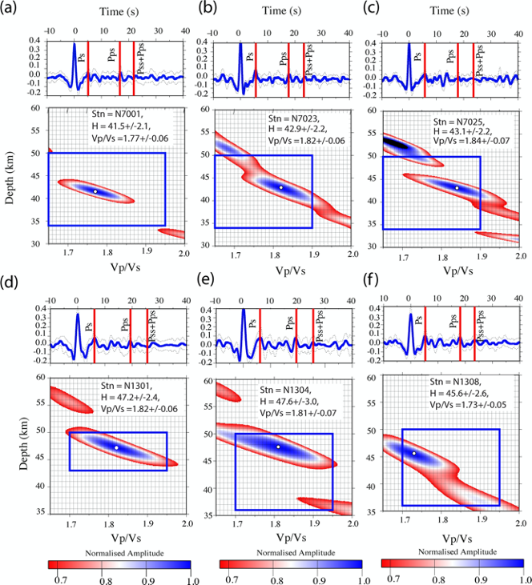
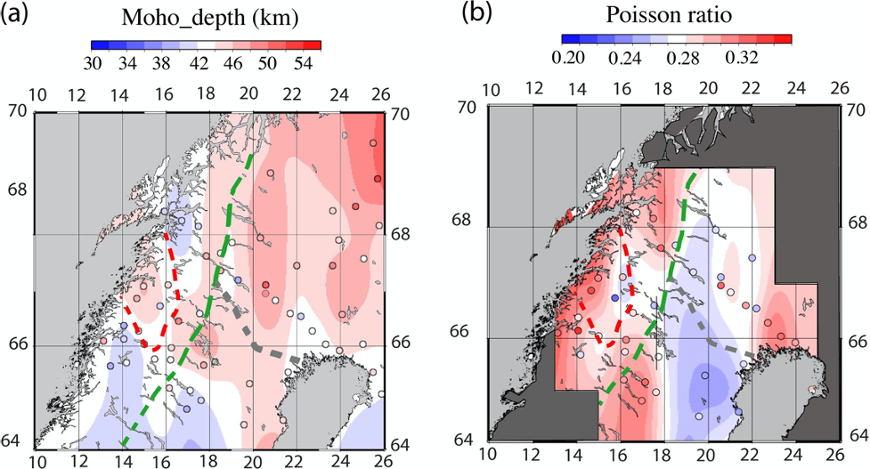

## Seismic study of the crust beneath the Northern Scandinavian mountains

**Project description:**
Conventional plate tectonic theory does not explain why parts of the continental crust significant distances from plate margins should move vertically, sometimes by substantial amounts (> 1 km). Such uplift events result in the rejuvenation of sediment source regions and can trigger the development of major reservoir sand sequences. Intraplate stress, dynamic support, and mantle upwelling have been invoked to account for such ‘Epeirogenic’ events but few quantitative observations exist which distinguish between competing theories. A substantial body of stratigraphic and geo-chronological evidence [1] suggests the Scandinavian mountains formed a high plateau region, at an altitude of c. 2 km above mean sea-level, during the Neogene c. 20 Ma ago, well before the onset of Quaternary glaciation. Neogene uplift and associated erosion has been the primary control on much of the present bathymetry and coastline of northern Europe [2] and was a major source of sediment supply to the North Sea and Norwegian continental slopes and margins. Paleogene uplift of northern Europe is attributed to North Atlantic opening and associated magmatic underplating but this cannot explain the more recent widespread Neogene uplift.The prime objective of this project is to attempt to identify the underlying cause of this uplift. This will be achieved by acquiring new passive seismic data.

**Collaborators:** Richard England, Max Moorkamp, Stewart Fishwick, Jorg Ebbing, Andreas Kohler

## Receiver functions
**Method:** Here, we use ZRT (vertical, radial and transverse) receiver functions calculated using the frequency domain method with a water level deconvolution (Ammon 1991; Clayton & Wiggins 1976; Langston 1979). The deconvolution removes source and propagation path affects from receiver effects after rotating the three-component waveforms to the backazimuth of the source path. This results in radial (ER) and transverse (ET) receiver functions. The water level is adjusted to the minimum value necessary to stabilize the deconvolution. In this study, a mean value of 10^−2 was selected, which reflects the relatively low signal-to-noise levels in much of the data. A Gaussian filter of width 2.0 was chosen which corresponds to a centre frequency of 1 Hz. Transverse receiver functions were used to identify noisy functions and the possibility of complex dipping structure beneath the station. 

**Results:** 
<figure>
   <figcaption>Examples of H–k stacking for three stations </figcaption>
  
</figure>

---

## Ambient seismic noise
**Method:** Lorem ipsum dolor sit amet, consectetur adipiscing elit, sed do eiusmod tempor incididunt ut labore et dolore magna aliqua. Ut enim ad minim veniam, quis nostrud exercitation ullamco laboris nisi ut aliquip ex ea commodo consequat. Duis aute irure dolor in reprehenderit in voluptate velit esse cillum dolore eu fugiat nulla pariatur. Excepteur sint occaecat cupidatat non proident, sunt in culpa qui officia deserunt mollit anim id est laborum.

**Results:** Lorem ipsum dolor sit amet, consectetur adipiscing elit, sed do eiusmod tempor incididunt ut labore et dolore magna aliqua. Ut enim ad minim veniam, quis nostrud exercitation ullamco laboris nisi ut aliquip ex ea commodo consequat. Duis aute irure dolor in reprehenderit in voluptate velit esse cillum dolore eu fugiat nulla pariatur. Excepteur sint occaecat cupidatat non proident, sunt in culpa qui officia deserunt mollit anim id est laborum.

---

## Publications

Ben Mansour, W, Fishwick, S , Köhler, A, England, R W, Moorkamp, M (under review). New crustal model across the northern Scandinavian mountains from Rayleigh wave ambient noise and receiver function analysis. 
 
Ben Mansour, W, England, R W, Fishwick, S, Moorkamp, M (2018). Crustal properties of the northern Scandinavian mountains and Fennoscandian shield from analysis of teleseismic receiver functions. Geophysical Journal International 214 (1), 386-401.

Ben Mansour W (2017). Crustal properties in the transition from orogenic to cratonics area from seismological analysis: example of the Baltic shield and the Scandinavian mountains. PhD thesis-University of Leicester.

England, R W, Ebbing Jorg, Ben Mansour, W (2016). SCANLIPS3D-SCANdinavian LIthosphere P and S wave experiment 3D. NERC-Geophysical Equiment Facility Report-Loan 959

**Conferences**

Ben Mansour, W, England,R W, Fishwick, S,  Köhler, A, Moorkamp, M , Ottemøller, L, Smirnov, M. Crustal properties in the continuum Baltic Shield-Scandinavian Mountains from seismic ambient noise and magnetotelluric analysis. EGU General Assembly 2016. Conference abstract (Poster).

Ben Mansour, W., Moorkamp, M., Kohler, A., Fishwick, S. IUGG General Assembly 2015-Prague. Conference abstact (Oral).

Ben Mansour,W , England, R.W.,Moorkamp, M. Seismic study of the crust beneath the Northern Mountains from Receiver Function analysis. EGU General Assembly 2015. Conference abstract (Poster).

Ben Mansour,W., Moorkamp, M., Köhler, A., Fishwick, S. Crustal study of the Northern Scandinavian Mountains from receiver functions analysis and surface wave ambient noise. Japanese Geoscience Union Meeting 2015. Conference abstract (Poster).

Ben Mansour, W., England, R. W., Moorkamp, M. Crustal imaging across the northern Scandinavian mountains from seismological and magnetotelluric data analysis. SEISMIX International Symposium on Multi-scale Seismic Imaging of the Earth's Crust and Upper Mantle 2014- Castelldefels. Conference abstract (Oral).

Ben Mansour, W, Moorkamp, M, England, R.W. Joint Inversion of Seismological Data and Magnetotelluric Data for the Northern Scandinavian Mountains. AGU Fall Meeting 2014. Conference abstract (Poster).

---
