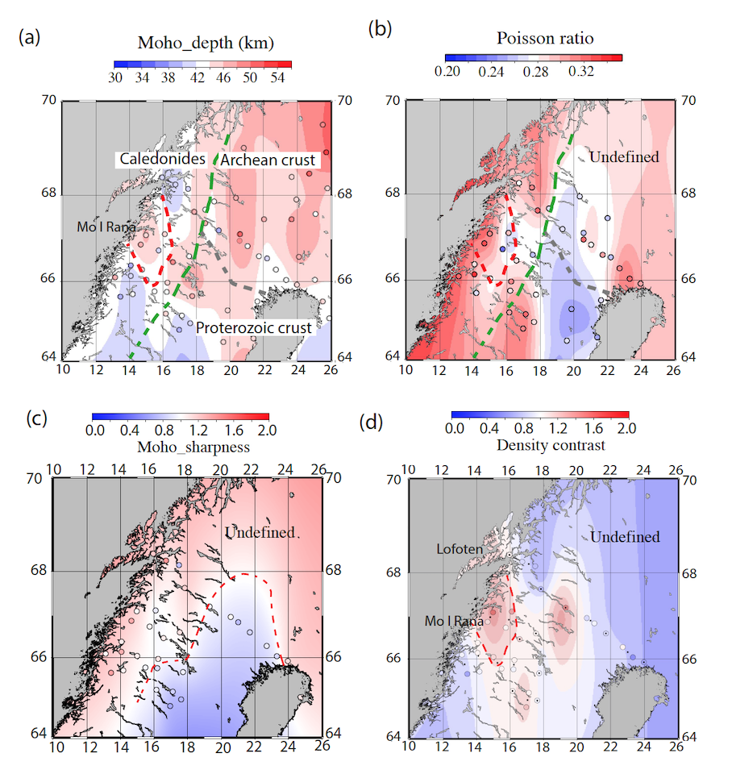

## Seismic study of the crust beneath the Northern Scandinavian mountains

**Project description:**
Conventional plate tectonic theory does not explain why parts of the continental crust significant distances from plate margins should move vertically, sometimes by substantial amounts (> 1 km). Such uplift events result in the rejuvenation of sediment source regions and can trigger the development of major reservoir sand sequences. Intraplate stress, dynamic support, and mantle upwelling have been invoked to account for such ‘Epeirogenic’ events but few quantitative observations exist which distinguish between competing theories. A substantial body of stratigraphic and geo-chronological evidence [1] suggests the Scandinavian mountains formed a high plateau region, at an altitude of c. 2 km above mean sea-level, during the Neogene c. 20 Ma ago, well before the onset of Quaternary glaciation. Neogene uplift and associated erosion has been the primary control on much of the present bathymetry and coastline of northern Europe [2] and was a major source of sediment supply to the North Sea and Norwegian continental slopes and margins. Paleogene uplift of northern Europe is attributed to North Atlantic opening and associated magmatic underplating but this cannot explain the more recent widespread Neogene uplift.The prime objective of this project is to attempt to identify the underlying cause of this uplift. This will be achieved by acquiring new passive seismic data.

**Collaborators:** Richard England, Max Moorkamp, Stewart Fishwick, Jorg Ebbing, Andreas Kohler

## Receiver functions
**Method:** Here, we use ZRT (vertical, radial and transverse) receiver functions calculated using the frequency domain method with a water level deconvolution (Ammon 1991; Clayton & Wiggins 1976; Langston 1979). The deconvolution removes source and propagation path affects from receiver effects after rotating the three-component waveforms to the backazimuth of the source path. This results in radial (ER) and transverse (ET) receiver functions. The water level is adjusted to the minimum value necessary to stabilize the deconvolution. In this study, a mean value of 10^−2 was selected, which reflects the relatively low signal-to-noise levels in much of the data. A Gaussian filter of width 2.0 was chosen which corresponds to a centre frequency of 1 Hz. Transverse receiver functions were used to identify noisy functions and the possibility of complex dipping structure beneath the station.

An analysis of the amplitude of the converted phases in receiver functions can provide information on the contrast in the change in velocity between the lower crust and the upper mantle. The sharpness of the Moho beneath a station can be quantified as the ratio of the amplitude of the Ps phase to the amplitude of the direct P-wave arrival on the SV component of the seismogram (Owens et al.1984). Primarily, the amplitude of the Ps phase depends on the contrast in P-wave to S-wave velocity across the Moho which determines how much energy is transmitted as a converted S-wave. A small contrast in velocity will result in a low amplitude S-wave and a low Ps/P amplitude ratio. A large contrast in velocity will result in a high amplitude S-wave and hence a high Ps/P amplitude ratio. The amplitude of the Ps phase can also be affected by the incidence angle of the teleseismic event at the base of the crust. When the angle is large, the amplitude of the Ps conversion is also large. However, its effect can be overcome by taking an average value of the Ps/P ratio for each station which will be associated with an average incident angle.  Here, we use a similar approach but use ZRT receiver functions and Moho sharpness is computed beneath each station by normalizing the Ps/P ratio for each P-receiver function by the average value of the Ps/P ratio for the whole array across the northern Scandinavian mountains and the Fennoscandian shield.Moho sharpness >1 suggests that the reference value is smaller than the ratio of Ps/P and hence the velocity contrast is large and the Moho transition is sharp. A Moho sharpness of R < 1 suggests a weak velocity contrast and a gradual transition.

**Results:** 
<figure>
   <figcaption>Main results from P-receiver functions analysis: </figcaption>
 
  
</figure>
<figure>

---
## Ambient seismic noise
The principle ideas of ambient seismic noise imaging were proposed by Aki [1957] to retrieve the propagation properties of the subsurface and Claerbout [1968] to reconstruct the reflectivity profile. In the 2000’s, a series of papers [Weaver and Lobkis 2001; Derode et al. 2003; Campillo and Paul 2003; Wapenaar 2004; Larose et al. 2005] suggested measuring the elastic response of the Earth by extracting Green’s functions from diffuse or random wavefields (e.g. ambient
noise, scattered coda waves). Seismic observations based on cross correlations between pairs of stations have confirmed the possibility to reconstruct surface waves Green’s functions using both coda waves [Campillo and Paul 2003; Paul et al. 2005; Froment et al. 2011; Chaput et al. 2016], long ambient noise sequences [Shapiro and Campillo 2004; Sabra et al. 2005; Shapiro et al. 2005; Poli et al. 2012b].

**Method:** We compute the vertical component of the cross-correlation matrix (Z-Z) using the methodology suggested by Bensen et al. [2007] to reconstruct the associated Rayleigh wave Green’s function. We process 2 sets of data corresponding to 2 recording periods of seismic noise (2007-2009 and 2013-2014) by using 48 seismic stations from 5 different seismic arrays (SCANLIPS2, SCANLIPS3D, LAPNET-POLENET, Finland seismological network, Norwegian National Seismic Network) covering our study area. We extracted about 500 group velocity (U) measurements from a frequency time analysis (FTAN) of the symmetric components (causal and acausal part) of the cross correlations. From our cross-correlograms, only the fundamental mode of the Rayleigh waves is visible due to the strong noise directivity from the interaction of Atlantic Ocean with the coast in our study area and weak velocity contrasts observed in Scandinavia.

**Results:** 

coming soon

---

## Publications

Ben Mansour, W, Fishwick, S , Köhler, A, England, R W, Moorkamp, M (under review). New crustal model across the northern Scandinavian mountains from Rayleigh wave ambient noise and receiver function analysis. 
 
Ben Mansour, W, England, R W, Fishwick, S, Moorkamp, M (2018). Crustal properties of the northern Scandinavian mountains and Fennoscandian shield from analysis of teleseismic receiver functions. Geophysical Journal International 214 (1), 386-401.

Ben Mansour W (2017). Crustal properties in the transition from orogenic to cratonics area from seismological analysis: example of the Baltic shield and the Scandinavian mountains. PhD thesis-University of Leicester.

England, R W, Ebbing Jorg, Ben Mansour, W (2016). SCANLIPS3D-SCANdinavian LIthosphere P and S wave experiment 3D. NERC-Geophysical Equiment Facility Report-Loan 959

**Conferences** 

Ben Mansour, W, England,R W, Fishwick, S,  Köhler, A, Moorkamp, M , Ottemøller, L, Smirnov, M. Crustal properties in the continuum Baltic Shield-Scandinavian Mountains from seismic ambient noise and magnetotelluric analysis. EGU General Assembly 2016. Conference abstract (Poster).

Ben Mansour, W., Moorkamp, M., Kohler, A., Fishwick, S. IUGG General Assembly 2015-Prague. Conference abstact (Oral).

Ben Mansour,W , England, R.W.,Moorkamp, M. Seismic study of the crust beneath the Northern Mountains from Receiver Function analysis. EGU General Assembly 2015. Conference abstract (Poster).

Ben Mansour,W., Moorkamp, M., Köhler, A., Fishwick, S. Crustal study of the Northern Scandinavian Mountains from receiver functions analysis and surface wave ambient noise. Japanese Geoscience Union Meeting 2015. Conference abstract (Poster).

Ben Mansour, W., England, R. W., Moorkamp, M. Crustal imaging across the northern Scandinavian mountains from seismological and magnetotelluric data analysis. SEISMIX International Symposium on Multi-scale Seismic Imaging of the Earth's Crust and Upper Mantle 2014- Castelldefels. Conference abstract (Oral).

Ben Mansour, W, Moorkamp, M, England, R.W. Joint Inversion of Seismological Data and Magnetotelluric Data for the Northern Scandinavian Mountains. AGU Fall Meeting 2014. Conference abstract (Poster).

---
